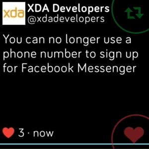

# fitbit-twitter
A Twitter client app for Fitbit OS



Downloadable from Fitbit App Gallary at [https://gam.fitbit.com/gallery/app/3344bcba-4f57-4b62-b6de-44c49fcab89d](https://gam.fitbit.com/gallery/app/3344bcba-4f57-4b62-b6de-44c49fcab89d)

# Prerequisites

- [Register](https://developer.twitter.com) a Twitter developer account
- [Create](https://developer.twitter.com/en/apps) a Twitter app to obatin a pair of `consumerKey` and `consumerSecret`
- Set the `consumerKey` and `consumerSecret` in `/companion/common.js`

# Getting started

First download and install the npm dependencies

```
$ yarn install
```

Then login to your Fitbit development account
```
$ npx fitbit
```

Build and install!
```
fitbit$ build-and-install
```